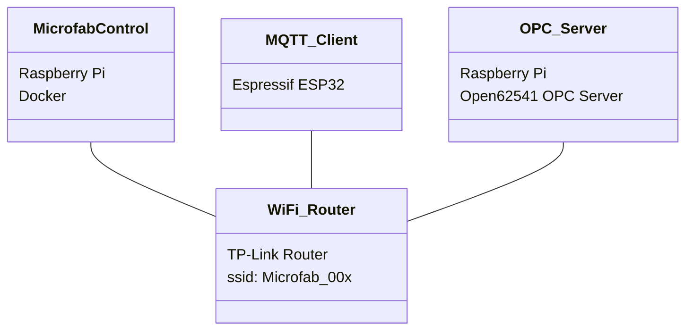
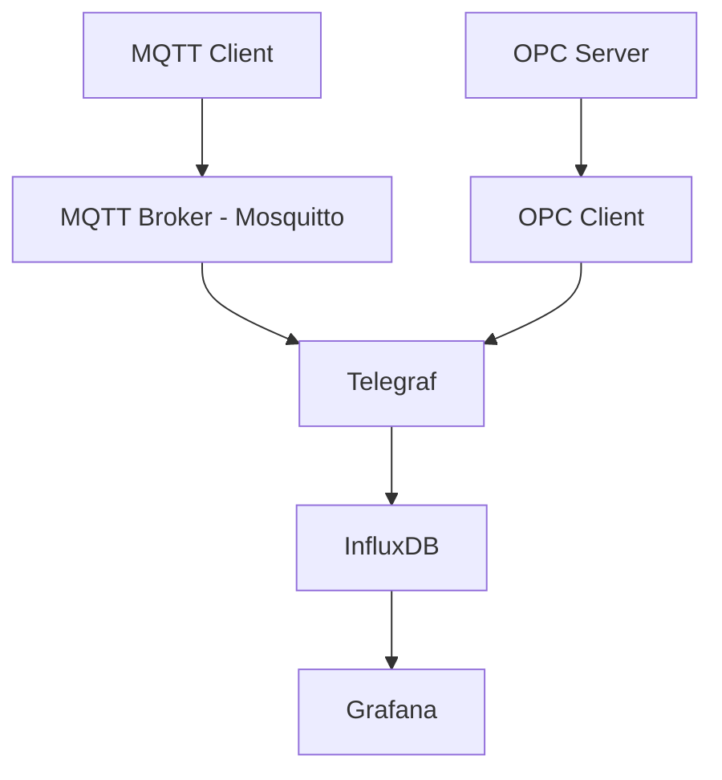

# microfab
Microfab abstracts the data traffic of a production onto a board. With two ESP32 and a Raspberry Pi OPC UA and MQTT are explained clearly

```mermaid
  classDiagram
      MicrofabControl -- WiFi_Router
      MQTT_Client -- WiFi_Router
      OPC_Server -- WiFi_Router

      class MicrofabControl{
          Raspberry Pi
          Docker
      }
      class WiFi_Router{
          TP-Link Router
          ssid: Microfab_00x
      }
      class MQTT_Client{
          Espressif ESP32
      }
      class OPC_Server{
          Raspberry Pi
          Open62541 OPC Server      
      }
      
```

```mermaid
  flowchart TB
        id1_1[MQTT Client]
        id1_2[OPC Server]
        id2_1[MQTT Broker - Mosquitto]
        id2_2[OPC Client]
        id3[Telegraf]
        id4[InfluxDB]
        id5[Grafana]

        id1_1 --> id2_1
        id1_2 --> id2_2
        id2_1 --> id3
        id2_2 --> id3
        id3 --> id4
        id4 --> id5
      
```
