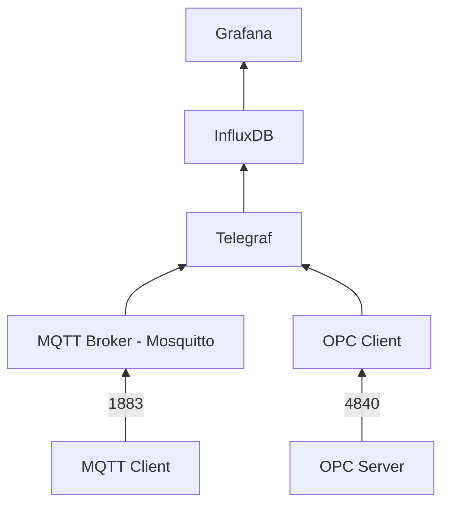
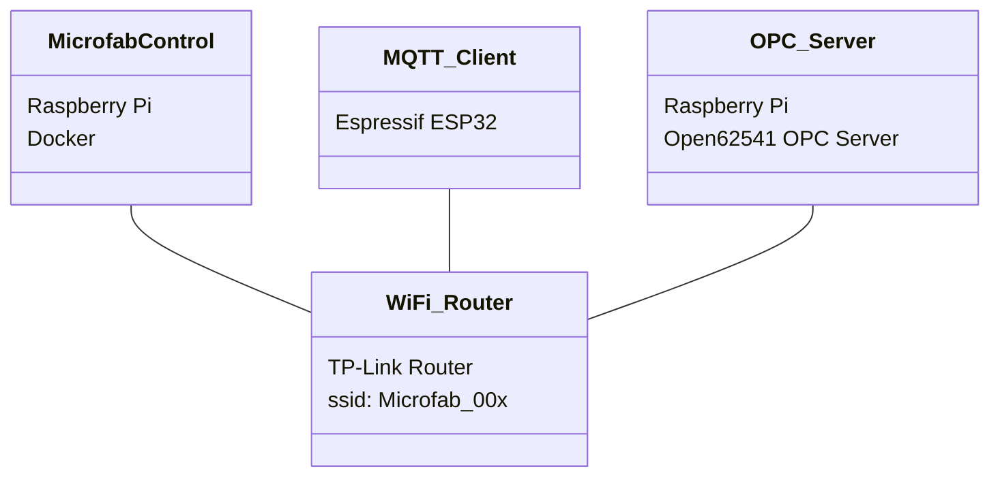

# microfab
Microfab abstracts the data traffic of a production onto a board. With two ESP32 and a Raspberry Pi OPC UA and MQTT are explained clearly

## Scenario

Two IoT nodes (ESP32 & Raspberry) sending data to an edge device (Raspberry Pi). 
The ESP32 sends its data via MQTT. The Raspberry Pi has implemented an OPC UA server which is accessed by the edge device. 
The data is stored on the edge device and can be visualized afterwards.

## Requirements

### Hardware

- Raspberry Pi 4B
- Espressif ESP32 microcontroller
- WiFi Router

### Software

- Raspberry Pi OS Lite 64bit
- Arduino IDE to program the ESP32

## Microfab Control

### Docker Containers

We use Docker to manage our services on Microfab Control. 

> Docker is a Free Software for isolating applications using container virtualization.
Docker simplifies application deployment by making it easy to transport and install 
containers that contain all the necessary packages as files. Containers ensure the 
separation and management of resources used on a computer. This includes: code, 
runtime module, system tools, system libraries - everything that can be installed on a computer.

[wikipedia]()

#### Mosquitto

> Eclipse Mosquitto is an open source implementation of a server for versions 5, 3.1.1, and 3.1 of the MQTT protocol

[dockerhub](https://hub.docker.com/_/eclipse-mosquitto)

A good introduction to the topic is provided by this [video](https://www.youtube.com/watch?v=INYG4-xsa9c) (German).

#### OPC UA Client

> Self-created OPC UA client that can be accessed via a browser

#### Telegraf

> Telegraf is an open source agent written in Go for collecting metrics and data on the system it's running on or from 
other services. Telegraf writes data it collects to InfluxDB in the correct format.

[dockerhub](https://hub.docker.com/_/telegraf)

#### InfluxDB

> InfluxDB is a time series database built from the ground up to handle high write and query loads. 
InfluxDB is meant to be used as a backing store for any use case involving large amounts of 
timestamped data, including DevOps monitoring, application metrics, IoT sensor data, 
and real-time analytics. 

[dockerhub](https://hub.docker.com/_/influxdb)

#### Grafana

> Grafana is a multi-platform open source analytics and interactive visualization web application. It provides charts, 
graphs, and alerts for the web when connected to supported data sources.

[dockerhub](https://hub.docker.com/r/grafana/grafana)

